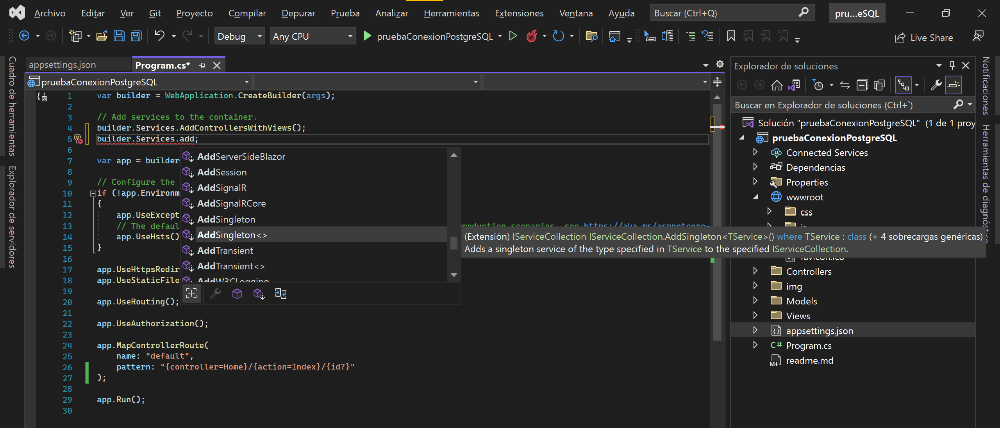

# Conexión PostgreSQL - ASP.NET (proyecto MVC)

<!-- TOC -->

- [1. Crear el proyecto](#crear-el-proyecto)
- [1.1. Esquema](#esquema)
- [2. Ejemplo MVC](#ejemplo-mvc)
- [2.1. *Add* section](#add-section)
- [2.2. Mostrar la vista del *Add* section](#mostrar-la-vista-del-add-section)
- [3. Conecxión con PostgreSQL](#conecxi%C3%B3n-con-postgresql)
- [3.1. Creamos la BBDD](#creamos-la-bbdd)
- [3.2. Instalamos el NuGet de PostgreSQL](#instalamos-el-nuget-de-postgresql)
- [3.3. *appsettings.json*](#appsettingsjson)
- [3.4. Volvemos al *program.cs* para añadir el servicio de *AddSingleton<>*](#volvemos-al-programcs-para-a%C3%B1adir-el-servicio-de-addsingleton)
- [3.5. Creamos la clase de la Conexion](#creamos-la-clase-de-la-conexion)
- [3.6. Volvemos al *HomeController.cs*](#volvemos-al-homecontrollercs)
- [3.7. Actualizamos la vista del *Home --> index.cshtml*](#actualizamos-la-vista-del-home----indexcshtml)
- [3.8. *wwwroot --> css --> site.css*](#wwwroot----css----sitecss)
- [4. Pulsamos el botón del *play* y...](#pulsamos-el-bot%C3%B3n-del-play-y)

<!-- /TOC -->

# 1. Crear el proyecto


**Nota**: lo que vemos de primeras cuando pulsamos el *play* y ejecutamos nuestro proyecto desplegándolo localmente con IIS, es el archivo *Views --> Home --> index.cshtml*.

# 1.1. Esquema


# 2. Ejemplo MVC

Primeramente, creamos una nueva clase llamada *DataModelcs* dentro del paquete de *Models*:


```csharp
namespace pruebaConexionPostgreSQL.Models
{
    public class DataModel
    {
        public List<DataModel> listModel = new List<DataModel>();

        public string name { get; set; }
        public int price { get; set; }
        public string date { get; set; }
        public string email { get; set; }
        public string department { get; set; }

    }
}
```

Ahora vamos al archivo *Controller --> HomeController.cs* en la que insertaremos unos datos sencillos de prueba, en el método principal que activa el index:

```csharp
public IActionResult Index()
        {
            DataModel list = new DataModel();

            list.listModel.Add
                (
                    new DataModel 
                    { 
                        name = "potato",
                        price = 100
                    }
                );

            list.listModel.Add
                (
                    new DataModel
                    {
                        name = "apple",
                        price = 50
                    }
                );

            list.listModel.Add
                (
                    new DataModel
                    {
                        name = "banana",
                        price = 10
                    }
                );

            List<DataModel> model = list.listModel.ToList();

            return View(model);
        }
```

Después, tenemos que ir al propio *index.cshtml* del Home para mostrar la vista de estos datos de prueba:

```csharp
@{
    ViewData["Title"] = "Home Page";
}

@model IEnumerable<pruebaConexionPostgreSQL.Models.DataModel>

<ul>
    @foreach(var o in Model){
        <li>@o.name</li>
        @*<li>@o.price</li>*@
    }
</ul>
```


# 2.1. *Add* section

Vamos al HomeController para crear un nuevo método de interfaz:

```csharp
public IActionResult Add()
        {
            return View();
        }
```

VS2022 nos subrayará el *Add* para que nosotros podamos hacer click derecho sobre él y poder crear una nueva vista de tipo Razor:


Ahora podemos apreciar que se nos ha creado esta vista en *Views --> Home --> Add.cshtml*:


# Mostrar la vista del *Add* section

El archivo que contiene toda la estructura de nuestra web es el *Views --> Shared --> _Layout.cshtml*... vamos a añadir en el navbar el enrutado a nuestro *Add* section:


Ahora necesitamos crear el respectivo controlador del componente *Add*, para que, de momento, tan sólo nos devuelva la vista del componente *Add* para mostrarlo:


Y si ahora, en el código de este controlador, sobre la palabra *Index* pulsamos click derecho, podemos generar una nueva vista (vista Razor) para el componente *Add*:


# 3. Conecxión con PostgreSQL

# 3.1. Creamos la BBDD


Creamos también una tabla a la que introduciremos una file de datos.


# 3.2. Instalamos el NuGet de PostgreSQL


# 3.3. *appsettings.json*

```json
{
  "Logging": {
    "LogLevel": {
      "Default": "Information",
      "Microsoft.AspNetCore": "Warning"
    }
  },
  "AllowedHosts": "*",
  "ConnectionStrings": {
    "MyServer": "Server=localhost;Port=5432;Database=pruebaConexionASP.NET;UserId=postgres;Password=12345"
  }
}
```


# 3.4. Volvemos al *program.cs* para añadir el servicio de *AddSingleton<>*




# 3.5. Creamos la clase de la Conexion


```csharp
using Npgsql;

namespace pruebaConexionPostgreSQL
{
    public class Conexion
    {

        // ATRIBUTOS
        public Server server;
        private string sql;
        public NpgsqlDataReader data;
        

        // CONSTRUCTORES
        public Conexion(string sql, IConfiguration server)
        {
            this.sql = sql;
            this.server = new Server(server);
            NpgsqlCommand query = new NpgsqlCommand(this.sql, this.server.conn);
            data = query.ExecuteReader();
        }


        // MÉTODOS
        public void Close()
        {
            this.server.conn.Close();
        }
    }


    // con esta "mini-clase", creamos efectivamente una conexión llamando a los parámetros de acceso a nuestra BBDD del archivo appsettings.json
    public class Server
    {

        // ATRIBUTOS
        public NpgsqlConnection conn;


        // CONSTRUCTORES
        public Server(IConfiguration server)
        {
            string connectionString = String.Format
                (
                    server.GetSection("ConnectionStrings").GetSection("MyServer").Value // con esto accedemos al appsettings.json --> "ConnectionStrings" --> "MyServer"
                );

            conn = new NpgsqlConnection(connectionString);
            conn.Open();
        }
    }
}
```

# 3.6. Volvemos al *HomeController.cs*

Vamos a hacer una serie de cambios para que se muestre efectivamente la fila de datos (potato) que introdujimos antes a mano (campo a campo) en la BBDD de *pruebaConexionASP.NET*.

**Nota**: borramos el código de esta clase en el que hicimos los tres elementos, y los elementos de *"apple"* y *"banana"*, también los vamos a añadir a través de *pgAdmin*:


```csharp
using Microsoft.AspNetCore.Mvc;
using pruebaConexionPostgreSQL.Models;
using System.Diagnostics;

namespace pruebaConexionPostgreSQL.Controllers
{
    public class HomeController : Controller
    {
        //private readonly ILogger<HomeController> _logger;

        public IConfiguration server;

        //public HomeController(ILogger<HomeController> logger)
        //{
        //    _logger = logger;
        //}

        public HomeController(IConfiguration server)
        {
            this.server = server;
        }

        public IActionResult Index()
        {
            DataModel list = new DataModel(); // creamos una lista del tipo de la clase modelo de nuestros datos

            string sql = "SELECT name, email, department FROM users"; // query de los campos que nos interesa obtener para mostrarlos
            Conexion cn = new Conexion(sql, this.server); // creamos un objeto del tipo de nuestra clase Conexion

            if (cn.data.HasRows) // si la BBDD contiene filas (datos)
            {
                while (cn.data.Read()) // mientras haya datos por leer...
                {
                    list.listModel.Add // ...añadimos a la lista...
                        (
                            new DataModel // un objeto por cada fila de datos que haya en la BBDD
                            {
                                name = cn.data[0].ToString(),
                                email = cn.data[1].ToString(),
                                department = cn.data[2].ToString(),
                            }
                        );
                }
            }

            cn.Close(); // siempre se debe cerrar la conexión al terminar de usar la BBDD
            
            /*
            list.listModel.Add
                (
                    new DataModel 
                    { 
                        name = "potato",
                        price = 100
                    }
                );

            list.listModel.Add
                (
                    new DataModel
                    {
                        name = "apple",
                        price = 50
                    }
                );

            list.listModel.Add
                (
                    new DataModel
                    {
                        name = "banana",
                        price = 10
                    }
                );
            */

            List<DataModel> model = list.listModel.ToList();

            return View(model);
        }

        public IActionResult Add()
        {
            return View();
        }

        public IActionResult Privacy()
        {
            return View();
        }


        [ResponseCache(Duration = 0, Location = ResponseCacheLocation.None, NoStore = true)]
        public IActionResult Error()
        {
            return View(new ErrorViewModel { RequestId = Activity.Current?.Id ?? HttpContext.TraceIdentifier });
        }
    }
}
```

**Nota**: actualización de la clase *DataModel.cs*:


# 3.7. Actualizamos la vista del *Home --> index.cshtml*

```csharp
@{
    ViewData["Title"] = "Home Page";
}

@model IEnumerable<pruebaConexionPostgreSQL.Models.DataModel>

@*<div class="text-center">
    <h1 class="display-4">Welcome</h1>
    <p>Learn about <a href="https://docs.microsoft.com/aspnet/core">building Web apps with ASP.NET Core</a>.</p>
</div>*@

<table>
    <tr>
        <th>Name</th>
        <th>Email</th>
        <th>Department</th>
    </tr>
    @foreach(var o in Model)
    {
        <tr>
            <td>@o.name</td>
            <td>@o.email</td>
            <td>@o.department</td>
        </tr>        
    }
</table>
```

# 3.8. *wwwroot --> css --> site.css*

Probamos a mejorar un poquito la presentación de la tabla que mostrará los elementos:


# 4. Pulsamos el botón del *play* y...


FUNCIONAA !! Se conecta a la BBDD de *pruebaConexionASP.NET* en nuestro PostgreSQL, lee las filas de datos y las reproduce en la tabla perfectamente!